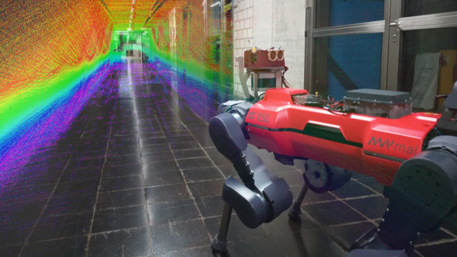

# DeLORA: Self-supervised Deep LiDAR Odometry for Robotic Applications

## Overview

* Paper: [link](https://arxiv.org/pdf/2011.05418.pdf)
* Video: [link](https://youtu.be/rgeRseUTryA)
* ICRA Presentation: [link](https://youtu.be/83Bn2zKi-bQ)

This is the corresponding code to the above paper ("Self-supervised Learning of LiDAR Odometry for Robotic
Applications") which is published at the International Conference on Robotics and Automation (ICRA) 2021. The code is
provided by the [Robotics Systems Lab](https://rsl.ethz.ch/) at ETH Zurich, Switzerland.

**
Authors:** [Julian Nubert](https://juliannubert.com/) ([julian.nubert@mavt.ethz.ch](mailto:julian.nubert@mavt.ethz.ch?subject=[GitHub]))
, [Shehryar Khattak](https://www.linkedin.com/in/shehryar-khattak/)
, [Marco Hutter](https://rsl.ethz.ch/the-lab/people/person-detail.MTIxOTEx.TGlzdC8yNDQxLC0xNDI1MTk1NzM1.html)



*Copyright IEEE*

## Python Setup

We provide a conda environment for running our code.

### Conda

The conda environment is very comfortable to use in combination with PyTorch because only NVidia drivers are needed. The
Installation of suitable CUDA and CUDNN libraries is all handle by Conda.

* Install conda: [link](https://docs.conda.io/projects/conda/en/latest/user-guide/install/index.html)
* To set up the conda environment run the following command:

```bash
conda env create -f conda/DeLORA-py3.9.yml
```

This installs an environment including GPU-enabled PyTorch, including any needed CUDA and cuDNN dependencies.

* Activate the environment:

```bash
conda activate DeLORA-py3.9
```

* Install the package to set all paths correctly:

```bash
pip3 install -e .
```

## ROS Setup

For running ROS code in the [./src/ros_utils/](./src/ros_utils/) folder you need to have ROS
installed ([link](http://wiki.ros.org/ROS/Installation)). We recommend Ubuntu 20.04 and ROS Noetic due to its native
Python3 support. For performing inference in Python2.7, convert your PyTorch model
with [./scripts/convert_pytorch_models.py](./scripts/convert_pytorch_models.py) and run an older PyTorch version (<1.3).

### ros-numpy

In any case you need to install ros-numpy if you want to make use of the provided rosnode:

```bash
sudo apt install ros-<distro>-ros-numpy
```

## Datasets and Preprocessing

Instructions on how to use and preprocess the datasets can be found in the [./datasets/](./datasets/) folder. We provide
scripts for doing the preprocessing for:

1. general **rosbags** containing LiDAR scans,
2. and for the **KITTI dataset** in its own format.

### Example: KITTI Dataset

#### LiDAR Scans

Download the "velodyne laster data" from the official KITTI odometry evaluation (
80GB): [link](http://www.cvlibs.net/datasets/kitti/eval_odometry.php). Put it to ```<delora_ws>/datasets/kitti```,
where ```kitti``` contains ```/data_odometry_velodyne/dataset/sequences/00..21```.

#### Groundtruth poses

Please also download the groundtruth poses [here](http://www.cvlibs.net/datasets/kitti/eval_odometry.php). Make sure
that the files are located at ```<delora_ws>/datasets/kitti```, where ```kitti```
contains ```/data_odometry_poses/dataset/poses/00..10.txt```.

#### Preprocessing

In the file ```./config/deployment_options.yaml``` make sure to set ```datasets: ["kitti"]```. Then run

```bash
preprocess_data.py
```

### Custom Dataset

If you want to add an own dataset please add its sensor specifications
to [./config/config_datasets.yaml](./config/config_datasets.yaml)
and [./config/config_datasets_preprocessing.yaml](./config/config_datasets_preprocessing.yaml). Information that needs
to be added is the dataset name, its sequences and its sensor specifications such as vertical field of view and number
of rings.

## Deploy

After preprocessing, for each dataset we assume the following hierarchical structure:
```dataset_name/sequence/scan``` (see previous dataset example). Our code natively supports training and/or testing on
various datasets with various sequences at the same time.

### Training

Run the training with the following command:

```bash
run_training.py
```

The training will be executed for the dataset(s) specified
in [./config/deployment_options.yaml](./config/deployment_options.yaml). You will be prompted to enter a name for this
training run, which will be used for reference in the MLFlow logging.

#### Custom Settings

For custom settings and hyper-parameters please have a look in [./config/](./config/).

By default loading from RAM is disabled. If you have enough memory, enable it
in [./config/deployment_options.yaml](./config/deployment_options.yaml). When loading from disk, the first few
iterations are sometimes slow due to I/O, but it should accelerate quite quickly. For storing the KITTI training set
entirely in memory, roughly 50GB of RAM are required.

#### Continuing Training

For continuing training provide the ```--checkpoint``` flag with a path to the model checkpoint to the script above.

### Visualizing progress and results

For visualizing progress we use MLFlow. It allows for simple logging of parameters, metrics, images, and artifacts.
Artifacts could e.g. also be whole TensorBoard logfiles. To visualize the training progress execute (from DeLORA
folder):

```bash
mlflow ui 
```

The MLFlow can then be visualized in your browser following the link in the terminal.

### Testing

Testing can be run along the line:

```bash
run_testing.py --checkpoint <path_to_checkpoint>
```

The checkpoint can be found in MLFlow after training. It runs testing for the dataset specified
in [./config/deployment_options.yaml](./config/deployment_options.yaml).

We provide an exemplary trained model in [./checkpoints/kitti_example.pth](./checkpoints/kitti_example.pth).

### ROS-Node

This ROS-node takes the pretrained model at location ```<model_location>``` and performs inference; i.e. it predicts and
publishes the relative transformation between incoming point cloud scans. The variable ```<dataset>``` should contain
the name of the dataset in the config files, e.g. kitti, in order to load the corresponding parameters. Topic and frame
names can be specified in the following way:

```bash
run_rosnode.py --checkpoint <model_location> --dataset <dataset> --lidar_topic=<name_of_lidar_topic> --lidar_frame=<name_of_lidar_frame>
```

The resulting odometry will be published as a ```nav_msgs.msg.Odometry``` message under the topic ```/delora/odometry```
.

#### Example: DARPA Dataset

For the darpa dataset this could look as follows:

```bash
run_rosnode.py --checkpoint ~/Downloads/checkpoint_epoch_0.pth --dataset darpa --lidar_topic "/sherman/lidar_points" --lidar_frame sherman/ouster_link
```

### Comfort Functions

Additional functionalities are provided in [./bin/](./bin/) and [./scripts/](./scripts/).

#### Visualization of Normals (mainly for debugging)

Located in [./bin/](./bin/), see the readme-file [./dataset/README.md](./dataset/README.md) for more information.

#### Creation of Rosbags for KITTI Dataset

After starting a roscore, conversion from KITTI dataset format to a rosbag can be done using the following command:

```bash
python scripts/convert_kitti_to_rosbag.py
```

The point cloud scans will be contained in the topic ```"/velodyne_points"```, located in the frame ```velodyne```. E.g.
for the created rosbag, our provided rosnode can be run using the following command:

```bash
run_rosnode.py --checkpoint ~/Downloads/checkpoint_epoch_30.pth --lidar_topic "/velodyne_points" --lidar_frame "velodyne"
```

#### Convert PyTorch Model to older PyTorch Compatibility

Converion of the new model ```<path_to_model>/model.pth``` to old (compatible with <
PyTorch1.3) ```<path_to_model>/model_py27.pth``` can be done with the following:

```bash
python scripts/convert_pytorch_models.py --checkpoint <path_to_model>/model
```

Note that there is no .pth ending in the script.

#### Time The Network

The execution time of the network can be timed using:

```bash
python scripts/time_network.py
```

## Paper

Thank you for citing [DeLORA (ICRA-2021)](https://arxiv.org/abs/2011.05418) if you use any of this code.

```
@inproceedings{nubert2021self,
  title={Self-supervised Learning of LiDAR Odometry for Robotic Applications},
  author={Nubert, Julian and Khattak, Shehryar and Hutter, Marco},
  booktitle={IEEE International Conference on Robotics and Automation (ICRA)},
  year={2021},
  organization={IEEE}
}
```

### Dependencies ###

Dependencies are specified in [./conda/DeLORA-py3.9.yml](./conda/DeLORA-py3.9.yml)
and [./pip/requirements.txt](./pip/requirements.txt).

### Tuning

If the result does not achieve the desired performance, please have a look at the normal estimation, since the loss is
usually dominated by the plane-to-plane loss, which is impacted by noisy normal estimates. For the results presented in
the paper we picked some reasonable parameters without further fine-tuning, but we are convinced that less noisy normal
estimates would lead to an even better convergence.
