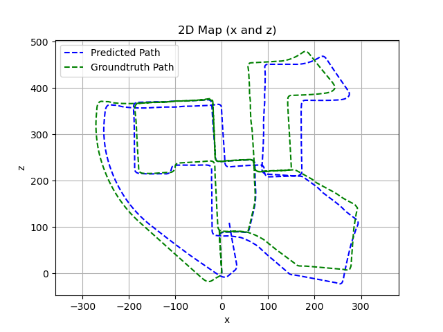
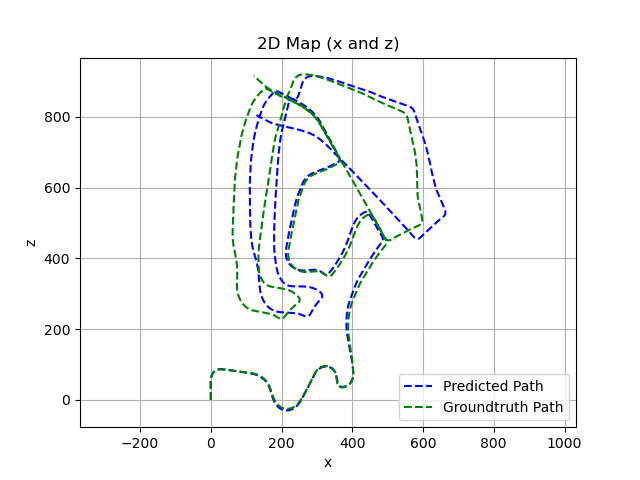
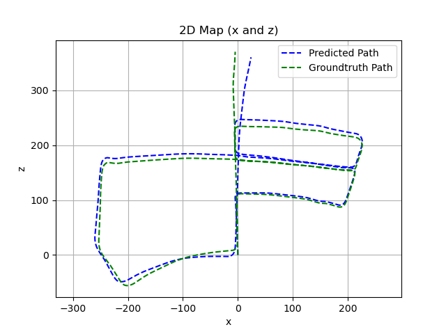
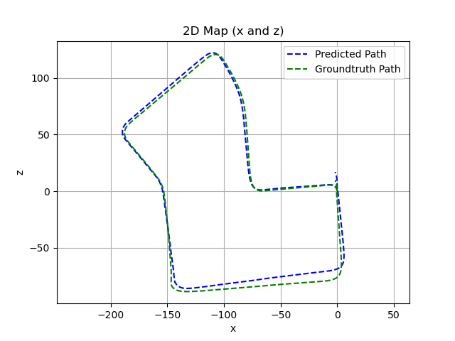
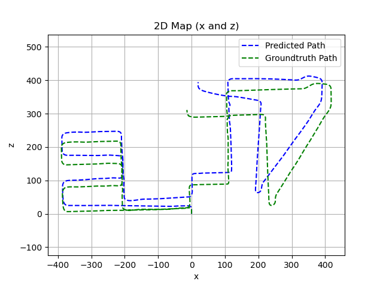

# Example network trained on the KITTI dataset

We provide an example network in ```kitti_example.pth```. Note that the checkpoint also includes the configuration of
the trained model. When loading the model, the corresponding configuration is set automatically.

The plots generated by the testing code for this model can be seen in the following:

| Sequence 00 | Sequence 02 |
| :---: | :---: |
|  |  |
| Sequence 05 | Sequence 07 |
|  |  |
| Sequence 08 | Sequence 10 |
|  |  |
